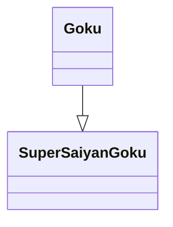
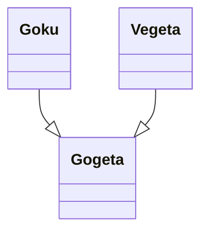
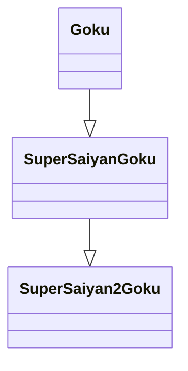
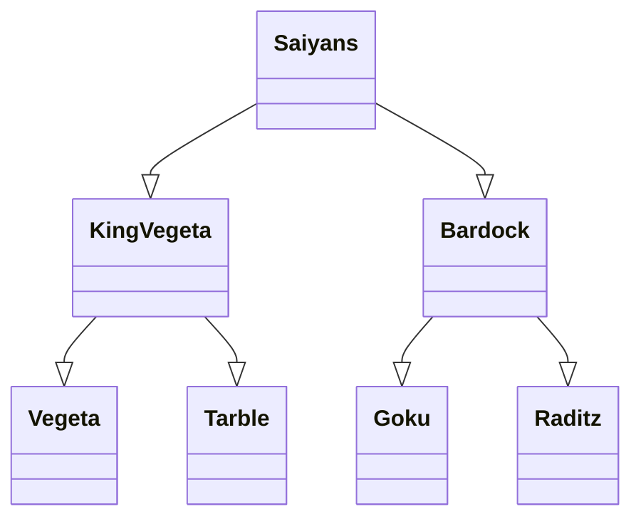
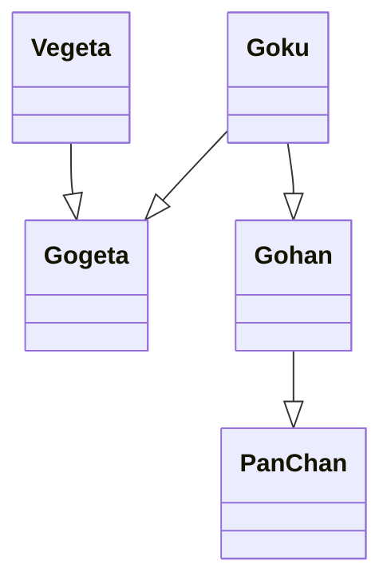

# C++ Guide

[toc]

### Compiling C++ 17 code

```bash
g++ -std=c++17 -Wall -pedantic main.cpp
```


### Input & Output

```c++
#include <iostream> 

using namespace std; 
  
int main() 
{ 
	int age; 
   // output
	cout << "Enter your age:"; 
   
   // input
	cin >> age; 
   
   // output
   cout << "\nYour age is: " << age << endl; 
  
   return 0; 
} 
```


### Loops

- Simple 'for' loop

```c++
for(int i = 0; i < 10; i++) {
    ...
}
```


- 'while' loop

```c++
#include <iostream> 
using namespace std; 
  
int main() 
{ 
   int i = 1;  
   while (i < 6) 
   { 
      cout << "Hello World\n"; 
      i++; 
   } 

   return 0; 
} 
```


- 'do...while' loop

```c++
#include <iostream> 
using namespace std; 
  
int main() 
{ 
    int i = 2;
    do
    { 
        cout << "Hello World\n"; 
       
        i++;  
    }  while (i < 1);
  
    return 0; 
} 
```


- Range based loops

```c++
std::vector<int> v = {0, 1, 2, 3, 4, 5}; 
for (auto i : v) 
	std::cout << i << ' '; 
```


- 'for_each' loop

```c++
#include<iostream> 
#include<vector> 
#include<algorithm> 

using namespace std; 
  
// helper function 1 
void printx2(int a) 
{ 
    cout << a * 2 << " "; 
}

int main() {
   // initializing array 
   int arr[5] = { 1, 5, 2, 4, 3 };
   vector<int> arr1 = { 4, 5, 8, 3, 1 };
   
   for_each(arr, arr + 5, printx2); // start, end, function
   for_each(arr1.begin(), arr1.end(), printx2);
   
   return 0;
}
```


### Pointers

A pointer in C is a way to share a memory address among different contexts (primarily functions). They are primarily used whenever a function needs to modify the content of a variable, of which it doesn't have ownership.

```c++
// get the address of a variable;
int val = 5;
int* p = &val; // storing the address in pointer

// get the value from a pointer 
cout << *p; // gives the value in 'val' variable = 5;
```


### String library 

```c++
#include <iostream>
#include <string>

using namespace std;

int main() {
   string str = "hello";
   string str2;
   
   // taking string input
   getline(cin, str2);
   
   str.sizes(); // length of string
   str.length(); // get the length of string
   str.resize(12); 
   str.capacity(); // returns the capacity of string
   str.shrink_to_fit();
   str.empty(); // check if empty
   
   // iterator
   str.begin();
   str.end();
   
   // access
   str[2]; // get elem at second pos
   str.at(2); // get elem at second pos
   str.front();
   str.back();
   
   // add
   str.push_back('s'); // insert a char
   str.append(" world");
   str.append(str2, 3); // append 3 letters from str2 from start
   str.append(str2, 6, 3); // append substr from 6 upto 3 letters
   str.append(10u, '.'); // append '.' ten times
   str.append(str3.begin()+8,str3.end());
   str += " name"; // concat 
   
   // remove
   str.pop_back();
   str.clear();
   
   str.substr(3,5); // from 3 upto 5 letters
   str.substr(3); // from 3 to end
   str.find("live"); // returns the position of live
   
   str.compare(str2); // 0: equals 
   str.compare(6, 5, "apple"); // from 6 upto 5 in str is apple or not
   str.compare(6, 5, str2, 4, 5); // 4 upto 5 in str 2
}
```


### String Stream

A stringstream associates a string object with a stream allowing you to read from the string as if it were a stream (like cin).

```c++
#include <iostream>
#include <sstream>
#include <string>

using namespace std;

int main() {
   string str = "this is a sentence";
   string str2 = "24,25,26";
   string word; // variable for storing individual words
   
   // creating a stream
   stringstream ss(str); // basic use is to break sentence into words
   stringstream ss2(str2);
   stringstream ss3;
   
   ss3 << 100 << " " << 200; // adding to stream manually
   
   ss.str(str);
   
   // getting words from stream
   ss.str()
   ss2 >> a >> ch >> b >> ch >> c; // "24" "," "25" "," ...
   
   ss >> word; // word = "this";
   ss >> word2; // word2 = "is";
   
   while(ss >> word){
      cout << word << endl;
   }
   
   // get string from stream
   ss.str();
      
   
   return 0;
}
```


### Maths library and functions

````c++
#include<iostream>
#include <numeric>
#include<cmath>
using namespace std;

int main() {
   cout << abs(-1); // 1 absolute value
   cout << sqrt(4); // 2 square root of a num
   cout << cbrt(27); // 3 cube root of a num
   cout << pow(2, 3); // 8 raise 2 to the power of 3
   cout << round(2.5); // 3 rounds off the num
   cout << floor(2.8); // 2 floor value 
   cout << ceil(2.1); // 3 ceil value 
   
   // sum of values in array
   accumulate(arr.begin(), arr.end(), 0); // start, end, initial value
}

````


### Arrays

```c++
#include<iostream>
using namespace std;

int main() {
   int arr[5] = {1, 2, 3, 4, 5}; // creating a simple array
}

```


### New & Delete Operators

```c++
#include <iostream>
using namespace std;

int main(){
   // allocating memory
   int *p = NULL;
   p = new int; // new returns pointer to the allocated memory
   
   int *p = new int;
   int *p = new int(2); // allocate and initialize memory
   float *p = new float(2.5); 
   int *p = new int[10]; // dynamically allocates memory for 10 ints continuously
   
   // avoid error in case of memory not available
   int *p = new(nothrow) int; // if no memory returns NULL
   
   if(!p){
      cout << "Memory allocation failed" << endl;
   }
   
   // deallocating memory 
   delete p; // release single variable
   delete[] p; // release block of memory
   
   // delete only works with pointers
   
   // 
   int x; 
   int* ptr1 = &x; 

   // x is present on stack frame as local variable, only dynamically 
   // allocated variables can be destroyed 
   // using delete operator 
   delete ptr1; // gives runtime error
}
```


### Lambdas (Anonymous functions)

**Understanding Lambdas :**

```c++
#include <iostream>

using namespace std;

int main() {
   // creating a lambda
   /*	
   	[](){}
   	[] = capture outside variables 
   	() = parameters
   	{} = function body
   */
   int i = 5;
   [&i] () { std::cout << i; }
   // above statement is equivalent to this:
   struct anonymous{
      int &m_i;
      anonymous(int &i): m_i(i){}; // initializer list
      inline auto operator()() const{
         cout << i;
      }
   }   
}
```


**Using Lambdas :** Reference : [link](https://medium.com/@DakshHub/lambdas-the-companion-of-modern-c-b7dfd43b5abb)

```c++
#include <iostream>
#include <vector>

using namespace std;

int main() {
   int val = 25;
   vector<int> arr = {1, 2, 3};
   
   // IIFE
   [](){ cout << "IIFE" << endl; }();
   
   // using a lambda
   for_each(arr.begin(), arr.end(), [](int x){
      cout << x << endl;
   })
      
   // capturing outside value
   auto printVal = [val](){ cout << val << endl; } // copy
   auto printVal2 = [&val](){cout << val << endl; } // reference
   auto printVal = [val]{ cout << val << endl; } // is also valid
   auto printVal = [=](){}; // capture all local scope vars by copy
   auto printVal = [&](){}; // capture all local scope by reference
   
   // lambda with return value
   int retLambda = []()->int{
   	return 123;
   }(); // calling the lambda
   
   // keeping a reference to lambda
   //     return (args)
   function<int (int)> myfunc = [](int val) -> int { return val + 10; };
   int result = myfunc(10);
   
   auto myfunc = [](int val) -> int { return val + 10; };
   int result = myfunc(2);
   
   // higher order returning lambda functions
   // its return signature is ugly so prefer auto 
   // but the ugly syntax is at the bottom of this block 
   const auto less_than = [](auto x){
      return [x](auto y){
         return y < x;
      };
   };
   
   auto less_than_five = less_than(5);
   cout << less_than_five(10) << endl;
   
   // ugly return syntax
   const function< function<bool (int)> (int) > less_than = [](int x){
      return [x](int y){
         return y < x;
      };
   };
 
   const function<bool (int)> less_than_five = less_than(5);
   
   // using capture list in class/struct
   // within a class function only 'this' is available
	struct AbcTest {
	   int i = 5;
	   int j = 4;
      int sumFn() {
         return [this](){
            return this->i + this->j;
         }(); // iife
		}
   };
   
   AbcTest obj;
   int sum = obj.sumFn();
}
```


## Standard Template Library (STL)

Components of STL are:

- **Algorithms** : The header algorithm defines a collection of functions especially designed to be used on ranges of elements. They act on containers and provide means for various operations for the contents of the containers.
- **Containers **: Containers or container classes store objects and data. There are in total seven standard “first-class” container classes and three container adaptor classes and only seven header files that provide access to these containers or container adaptors.
- **Functions** : The STL includes classes that overload the function call operator. Instances of such classes are called function objects or functors. Functors allow the working of the associated function to be customized with the help of parameters to be passed.
- **Iterators** : iterators are used for working upon a sequence of values. They are the major feature that allow generality in STL.
- **Utility** : Defined in header <utility>.

Reference : [Link](https://www.geeksforgeeks.org/the-c-standard-template-library-stl/)


### Algorithms

cplusplus.com : Reference [link](https://www.cplusplus.com/reference/algorithm/)

geeksforgeeks.org : Reference [link](https://www.geeksforgeeks.org/algorithms-library-c-stl/)


#### Sort

```cpp
#include <algorithm>

std::sort(arr.begin(), arr.end()); // asc
std::sort(arr.begin(), arr.end(), greater<int>()) // desc
```


### Containers 

**Sequence Containers** : Can be accessed in sequential manner


- Array : reference [link](https://www.cplusplus.com/reference/array/array/)

```c++
#include<array>

using namespace std;

int main() {
   array<int,6> arr = {1, 2, 3, 4, 5, 6};
   // access value;
   arr[0]; // 1
   arr.at(3); // 4
   arr.front(); // first elem 1
   arr.back(); // last elem 6
   
   arr.size(); // num of elem in arr
   arr.max_size(); // max size it can hold i.e. with which it is declared
   
   arr.swap(arr2); // swaps all elem of one arr with other
   
   arr.empty(); // check if arr is empty
   arr.fill(0); // fill arr with specified val
}
```


- Vector : dynamic arrays

```c++
#include <vector>
#include <functional> // greater function
#include <algorithm> // sort function
using namespace std;

int main() {
   vector<int> arr = {1, 2, 3, 4};
   vector<int> vect(3, 10); // 3 is the size, 10 is the default val for all
   
   arr.size(); // num of elem in vector
   arr.capacity(); // current allocated size of vector
   arr.max_size(); // max num of elem vector can hold
   arr.resize(4); // resizes vector to specified size
   arr.empty(); // checks if empty
   arr.shrink_to_fit(); // shrinks vector to size and remove extra capacity
   arr.reserve(10); // modify initial capacity of vector;
   
   // access val
   arr[2]; // 3
   arr.at(2); // 3
   arr.front(); // first elem
   arr.back(); // last elem
   int* pos = arr.data(); // return pointer to first elem
   *pos; // 1
   
   // iterators
   arr.begin(); // returns iterator pointing to beginning
   arr.end(); // returns iterator pointing to end
   arr.cbegin(); // returns constant iterator
   arr.cend(); // returns constant iterator
   
   // adding val
   arr.assign(5, 10); // add 10 five times
   arr.push_back(5); // add 5 at the end
   arr.pop_back(); // removes last elem
   auto it = arr.insert(arr.begin(), 3); // add 3 at the beginning
   arr.insert(arr.begin() + 2, 3); // add 3 at index 2
   arr.insert(arr.begin() + 2, {10, 20, 30}); // add multiple val
   arr.insert(arr.begin(), 2, 5); // insert 5 two times at the start
   
   // emplace to add val
   // iterator vector_name.emplace (const_iterator position, element);
   auto it = arr.emplace(arr.begin(), 10); // add elem at beginning
   arr.emplace_back(5); // adds element at the end
   
   // remove val
   arr.clear(); // remove all elems
   arr.erase(arr.begin()); // remove elem from start
   // erase last position is exclusive
   arr.erase(arr.begin(), arr.begin() + 2); // remove elem from start to 1 index
   arr.swap(arr2); // swaps one vector with another of same type
   
   // sort
   sort(arr.begin(), arr.end()); // asc
   sort(arr.begin(), arr.end(), greater<int>()); // desc
   
   // getting input from stdin in vector
   int n;
   cin >> n;
   vector<int> v(n);
   for (auto &it : v) {
   	cin >> it;
   }
}
```


- Deque : Double ended queue, more efficient than vectors in insertion and deletion

WARNING: contiguous storage allocation may not be guaranteed

```c++
#include <deque>

using namespace std;

int main() {
   deque<int> queue;
   
   // add val
   queue.push_back(); // insert elem at end
   queue.push_front(); // add elem at front
   
   queue.size(); // get the num of elems
   queue.max_size(); // max size of a queue
   
   // emplace to add
   queue.emplace_back();
   queue.emplace_front();
   
   // remove elem
   queue.pop_back();
   queue.pop_front();
   
   // *** all other methods are similar to vector ***
}
```


- Forward list : singly linked list (time constant insertion and deletion)

WARNING: cannot be iterated backward, cannot access element directly

```c++
#include <forward_list>

using namespace std;

int main() {
   forward_list<int> list = {1, 2, 3};
   list.assign({1, 2, 3});
   list.assign(5, 10); // add 10 five times
   
   // forward list does not have a size method
   
   // iterating
   for (int &a : list) {
        cout << a << " "; 
   }
   
   // access val
   list.front();
   list.begin();
   list.end();
   list.before_begin();
   list.empty();
   
   // resize
   list.resize(10);
   
   // adding elem
   list.push_front(50); // add elem to front
   list.emplace_front(10);
   list.insert_after(list.begin(), {1, 2, 3}); // insertion from 2nd position 
   list.emplace_after(list.begin(), 2);
   list.splice_after(list.begin(), list2);
   
   // removing elem
   list.pop_front();
   list.erase_after(list.begin());
   list.remove(40); // remove all 40s
   // removes all values greater than 20
   list.remove_if([](int x){ return x > 20; }); 
   
   // sort
   list.sort(); // O(nlogn)
}
```


- List : doubly linked list, fast insertion n deletion

WARNING: slow traversal

```c++
#include <list>

using namespace std;

int main() {
   list<int> mylist = {1, 2, 3, 4};
  	
   mylist.assign(5, 10); // add 10 five times
   
   mylist.size();
   mylist.resize();
   
   // iterators
   mylist.begin();
   mylist.end();
   
   // access elem
   mylist.front();
   mylist.back();
   mylist.empty();
   
   // add elem
   mylist.push_back(5);
   mylist.push_front(0);
   mylist.insert(mylist.begin(), 2, 7); // insert 7 two times
  	mylist.emplace_back(2);
   mylist.emplace_front(7);
   mylist.merge(mylist2);
   
   bool comparator(int first, int second) { return first < second; }
   mylist.merge(mylist2, comparator); // combines based on comparator
   
   mylist.splice(mylist.begin(), mylist2); // add all elem at position
   
   				 // position, second list, item iterator
   mylist.splice(mylist.begin(), mylist2, mylist2.begin()); // add one elem
   // add a part of list 2 to list 1
   mylist.splice(mylist.begin(), mylist2, mylist2.begin(), mylist2.end());
   
   mylist.emplace(mylist.begin(), 1);
   
   // remove elem
   mylist.pop_back();
   mylist.pop_front();
   mylist.erase(mylist.begin());
   mylist.erase(mylist.begin(), mylist.begin() + 2);
   mylist.remove(20); // remove all 20s
   mylist.remove_if([](int x) { return x < 20; });
   mylist.unique(); // removes duplicates
   mylist.clear();
   
   bool compare(double a, double b) { return ((int)a == (int)b); }
   mylist.unique(compare); 
   
   // reverse
   mylist.reverse();
   
   // sort
   mylist.sort();
}
```


**Associative Containers** : implement sorted data structures that can be quickly searched O(log n) complexity. 

- Set : a type of associative containers in which each element has to be unique, because the value of the element identifies it.  Internally store elements in balanced binary tree.

WARNING: The value of the element cannot be modified once it is added to the set, though it is possible to remove and add the modified value of that element.

```c++
#include <set>

using namespace std;

int main() {
   set<int> myset = {1, 2, 3};
   
   myset.empty();
   myset.size();
   myset.max_size();
   
   // iterators
   myset.begin();
   myset.end();
   
   // add elems
   myset.insert(10);
   myset.emplace(7);
   
   // remove
   myset.erase(myset.begin());
   myset.erase(myset.begin(), myset.end());
   
   // find
   auto pos = myset.find(3); // find position of 3
}
```


- Map : stores data in key value pairs

```c++
#include <map>

using namespace std;

int main() {
   map<int, int> mymap;
   map<int, int> mymap2 = {
      pair<int, int> (1, 1),
      pair<int, int> (2, 2)
   };
   
   // add elems
   mymap.insert(pair<int, int>(1, 40));
   mymap.insert(pair<int, int>(1, 50)); // won't work, not allowed
   mymap[3] = 7;
   
   // access elem
   auto itr = mymap.begin();
   itr->first; // (*itr).first
   itr->second; // (*itr).second
   
   mymap[2];
   
   auto pos = mymap.find(2); // find 2 key and returns iterator
   
   
   // remove
   mymap.erase(4); // remove all elem with key 4
   mymap.erase(mymap.begin(), mymap.find(3)); // remove all elem upto 3
   
      
}
```


### Iterators

Iterators play a critical role in connecting algorithm with containers along with the manipulation of data stored inside the  containers


```c++
#include <vector>
#include <iterator>

using namespace std;

int main() {
   vector<int> arr = { 1, 2, 3, 4, 5 };
   
   // declaring an iterator
   vector<int>::iterator ptr = arr.begin();
   
   // advance iterator
   advance(ptr, 3); // advance iterator by 3 i.e to position 4
   
   // next and prev to return new iterator instead of advancing
   auto it = next(ptr, 3); // points to 4;
   auto it2 = prev(ptr, 3); // points to 3;
}
```


### Functions

- **Functors** : objects that can be treated as though they are a function or function pointer. A functor (or function object) is a C++ class that acts like a function. Functors are called using the same old function call syntax. To create a functor, we create a object that overloads the *operator()*.

```c++
struct MyAddFunctor {
	int x; // acts as a state
   
	// Constructor
	MyAddFunctor(int inp){
		x = inp;
	}
	
	// Overloading or Defining operator()
	int operator()(int y){
		return x+y;
   }
};

int main(){
   // constructor
   MyAddFunctor func(5); // creating a function with initial state 5
   // calling the object i.e invoking the overloaded operator ()
   func(10); // adding 10 to state
   
}
```


### Utility

- Pair


```c++
using namespace std;

int main() {
   pair<int, int> mypair (1, 2);
   pair<int, int> mypair2 = {1, 2};
   pair<int, int> mypair3 = make_pair(1, 2);

   // access
   mypair.first; // get first value
   mypair.second; // get second value

   // swap
   mypair.swap(mypair2); // swaps two pairs

   return 0;
}
```


## Functional Programming


#### Transform (Array map function)

```c++
#include <iostream>
#include <vector>
#include <algorithm>

using namespace std;

// normal function
int incrementByOne(x){
   return x + 1;
}

// functors
struct addFive{
   int operator()(int x){
      return x + 5;
   }
};

struct addVal{
   int val;
   
   addVal(int inp): val(inp){}
   
   int operator()(int x){
      return val + x;
   }
};

int main()
{
   vector<int> arr = {1, 2, 3};
   vector<int> newArr(arr.size());
   
   /*
   	transform(Iterator inputBegin, Iterator inputEnd, 
                  Iterator OutputBegin, unary_operation);
   */
   transform(arr.begin(), arr.end(), newArr.begin(), addVal(2));
   transform(arr.begin(), arr.end(), arr.begin(), incrementByOne);
   
   /*
   	transform(
   		Iterator inputBegin1, Iterator inputEnd1,
      	Iterator inputBegin2, Iterator OutputBegin,
      	binary_operation
      ); 
   */
   transform(
      arr1.begin(), arr1.end(),
      arr2.begin(), result.begin(),
      [](int x, int y){ return x * y; }
   )
   
   return 0;
}
```


#### Copy_if & Remove_if (Array filter functions)

```c++
#include <vector>
#include <algorithm>

using namespace std;

int main() {
   vector<int> arr = {1, 2, 3, 4, 5};
   vector<int> result;
   
   // back_inserter calls push_back internally
   copy_if(arr.begin(), arr.end(), back_inserter(result), [](int x){
      return x % 2 == 0;
   });
   
   // change the existing arr
   // remove_if does not delete elements...it just moves them
   auto newend = remove_if(arr.begin(), arr.end(), [](int x){
      return x < 4;
   });
   arr.erase(newend, arr.end());
   // before remove: 1 2 3 4 5
   // after remove:  4 5 3 4 5
   // after erase:   4 5
   
}
```


#### Accumulate (Array reduce function)

```c++
#include <iostream>
#include <numeric>
#include <vector>
using namespace std;

int main() {
   vector<int> arr = {1, 2, 3, 4};
   
   int sum = accumulate(arr.begin(), arr.end(), 0); // default: add
   int product = accumulate(arr.begin(), arr.end(), 1, [](int acc, int x){
      return acc * x; // acc is the accumulator, x is the value in arr
   });
   
}
```


#### All_of (Array every function)

Checks if all elements of array satisfy the given condition

```c++
#include <iostream>
#include <vector>
#include <altorithm>
using namespace std;

int main() {
    vector<int> arr = {1, 2, 3, -2};
   
    bool result = all_of(arr.begin(), arr.end(), [](int x){
        return x > -1;
    });
}
```


#### Any_of (Array some function)

Checks if any of the element in array satisfy the given condition

```c++
#include <iostream>
#include <vector>
#include <altorithm>
using namespace std;

int main() {
	vector<int> arr = {1, 2, 3, -2};

	bool result = any_of(arr.begin(), arr.end(), [](int x){
      return x > -1;
   });
}
```


#### None_of 

Returns true if none of the element in array satify the given condition

```c++
#include <iostream>
#include <vector>
#include <altorithm>
using namespace std;

int main() {
   vector<int> arr = {1, 2, 3, 0};
   
   // check if none of the element is negative
   bool result = none_of(arr.begin(), arr.end(), [](int x){
      return x < 0;
   });
}
```


## Object Oriented Programming


### Classes

- Classes in C++ are user defined types declared with keyword class that has data and functions. 
- The data members of a class are private by default
- An **Object** is an instance of a Class. When a class is defined, no memory is allocated but when it is instantiated (i.e. an object is created) memory is allocated.

````c++
#include <iostream>

using namespace std;

class SampleClass {
	private:
		int val;
	public:
   	int num;
      void set(int a) {
      	val = a;
      }
      int get() {
      	return val;
      }
};

int main() {
   // creating objects: className objectName
   SampleClass obj;
   
   // access member functions and variables
   obj.num = 2;
   obj.get(); 
	
   return 0;
}
````


- Another way to define class member function:

```c++
#include <iostream>
#include <string>

using namespace std;

class Sample{
   public:
		string name;
   	int val;
   	void printName(); // not defined inside class
}

// definition of printName with scope resolution operator ::
void Sample::printName(){
   cout << name << endl;
}

int main() {
   Sample obj;
   obj.name = "paras";
   obj.val = 2;
   obj.printName();
}
```


#### Constructors : 

A constructor is a member function of class which is called everytime when an object is created. Constructors have same as class.

**Types of constructors are:**

- default constructor
- parametrized constructor
- copy constructor : If we don’t define our own copy constructor, the C++ compiler creates a default copy constructor for each class which does a member-wise copy between objects. The compiler created copy constructor works fine in general. We need to define our own copy constructor only if an object has pointers or any runtime allocation of the resource like file handle, a network connection..etc. Default one creates shallow copy only.  [more info](https://www.geeksforgeeks.org/copy-constructor-in-cpp/)

```c++
class Sample{
   public:
   	int val, val2;
   	// default constructor
   	Sample(){ /* .. do stuff on instantiation */ }
   	// parametrized constructor
   	Sample(int a){/* .. do some stuff here */}
   	// initializer list
   	Sample(int a, int b):val(a), val2(b)
         {}
   
   	Sample(Sample &obj) { val = obj.val; }
}

int main() {
   Sample obj; // default constructor
   Sample obj2(2); // parameterized constructor
   Sample obj3 = obj2; // copy constructor
   obj = obj2; // not copy constructor but assignment operator
}
```


#### Destructor: 

Destructor is called when the scope of object ends.

```c++
class Sample{
   public:
   	~Sample(){
         // deallocate memory and do other stuff
      }
}

int main() {
   int i = 0;
   while(i < 1){
      Sample obj;
      i++;
   } // scope of obj ends here and destructor is called
}
```


#### Access modifier:

- **Public Members:** accessible from anywhere and we can set and get value without any member function.
- **Private Members:** not accessible outside the class. Only class and friend functions can access private members.
- **Protected Members:** similar to private but can be accessed in immediate derived class 


```c++
class Example{
	private:
		int a; // accessible within class
  	protected: 
   	int b; // accessible within class and derived class
   public:
   	int c; // accessible anywhere 
};
```


### Inheritance

The capability of a class to derive properties and characteristics from another class is called **Inheritance**.

- **Sub Class:** The class that inherits properties from another class is called Sub class or Derived Class.
- **Super Class:** The class whose properties are inherited by sub class is called Base Class or Super class.


#### Example:

```c++
#include <iostream>
using namespace std;

// base class or super class
class Parent {
   public: 
   	int parent_var = 1;
};

// derived class or sub class
class Child : public Parent { // inheritance
   public:
   	int child_var = 2;
}

int main() {
   Child child_obj;
   
   child_obj.child_var; // can access its own variables
   child_obj.parent_var; // can access parent's variables   
}
```


#### Modes of inheritance:

- **Public Mode:** public members of base class will become public in derived class and protected members of base class will become protected in derived class.
- **Protected Mode:** both public member and protected members of the base class will become protected in derived class.
- **Private Mode:** both public member and protected members of the base class will become Private in derived class.


````c++
class Parent{};
class Child : public Parent{};
class Child : private Parent{};
class Child : protected Parent{};
````


#### Types of Inheritance 

Reference: [Link](https://www.geeksforgeeks.org/inheritance-in-c/#Types%20of%20Inheritance)

- **Single Inheritance:** a class is allowed to inherit from only one class. i.e. one sub class is inherited by one base class only.
- **Multiple Inheritance:** Multiple Inheritance is a feature of C++ where a class can inherit from more than one classes. i.e one **sub class** is inherited from more than one **base classes**.
- **Multilevel Inheritance:** a derived class is created from another derived class.
- **Hierarchical Inheritance:** more than one sub class is inherited from a single base class. i.e. more than one derived class is created from a single base class.
- **Hybrid Inheritance:** Hybrid Inheritance is implemented by combining more than one type of inheritance. For example: Combining Hierarchical inheritance and Multiple Inheritance.


##### Single Inheritance



```c++
class Goku {};

class SuperSaiyanGoku : public Goku {};
```


##### Multiple Inheritance



```c++
class Goku {};
class Vegeta {};

class Gogeta : public Goku, public Vegeta {};
```


##### Multilevel Inheritance



```c++
class Goku {};
class SuperSaiyanGoku : public Goku {};
class SuperSaiyan2Goku : public SuperSaiyanGoku {};
```


##### Hierarchical Inheritance



```c++
class Saiyans {};

class KingVegeta : public Saiyans {};
class Bardock : public Saiyans {};

class Vegeta : public KingVegeta {};
class Tarble : public KingVegeta {};

class Goku : public Bardock {};
class Raditz : public Bardock {};
```


##### Hybrid Inheritance 



```c++
class Vegeta {};
class Goku {};

class Gogeta : public Vegeta, public Goku {};

class Gohan : public Goku {};
class PanChan : public Gohan {};
```


## Overloading in C++

WARNING: overloading is not possible for the following: `. (dot)`  `::`  `? :`  `sizeof`

### Operator overloading

Reference: [link](https://www.geeksforgeeks.org/operator-overloading-c/)

```c++
#include <iostream>

using namespace std;

class Complex{
   private: 
   	int a, b;
   public:
   	Complex(int x=0, int y=0): a(x), b(y){}
   	// overloading operator + for complex class
      //This is automatically called when '+' is used with 
      // between two Complex objects 
   	Complex operator + (Complex const &obj){
         // somehow we are able to access pvt. variables inside class
         Complex result;
         result.a = a + obj.a;
         result.b = a + obj.b;
      }
   
   	
   	// overload comparision
   	bool operator < (Complex const &obj){
         // example condition
         if(a < obj.a && b < obj.b) return true;
         return false;
      }
};
```


- **Overload insertion(<<) and extraction(>>) operators**
  1. cout is an object of ostream class and cin is an object istream class
  2. These operators must be overloaded as a global function. And if we want to allow them to access private data members of class, we must make them friend.

Reference: [link](https://www.geeksforgeeks.org/overloading-stream-insertion-operators-c/)

```c++
#include <iostream>
using namespace std;

class Complex{
	private: 
   	int a, b;
   public: 
   	friend ostream& operator << (ostream& out, Complex &obj){
         out << obj.a << " " << obj.b << endl;
         return out;
      }
   	
   	// example with definition outside class
   	friend istream & operator >> (istream &in,  Complex &c);
};

istream & operator >> (istream &in,  Complex &c) 
{ 
    cout << "Enter first number"; 
    in >> c.a; 
    cout << "Enter second number"; 
    in >> c.b; 
    return in; 
}

int main() {
   Complex x;
   cin >> x;   
   cout << x;
   
   return 0;
}
```


## Notes

- Header files are for classes and their methods, and cpp files are for implementations and definitions of class methods 

```cpp
// Car.h
class Car {
   public: 
   	int run;
   	void start(bool a);
};

// Car.cpp
#include "Car.h";

void Car::start(bool a) {
   // .. definition here ..
}
```

